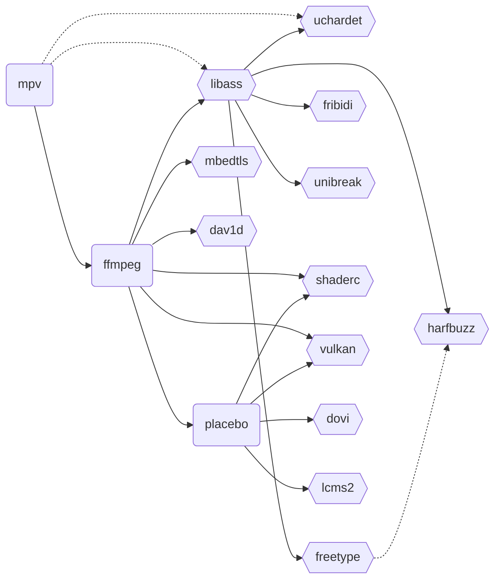

Fork from https://github.com/mpvkit/MPVKit

## How to build
```sh
# Components:
# ass, dav1d, dovi, ffmpeg, freetype, fribidi
# harfbuzz, littlecms2, mbedtls, mpv, placebo
# shaderc, spirvcross, uchardet, unibreak, vulkan
./gradlew assemble $component_name
```

## Components

